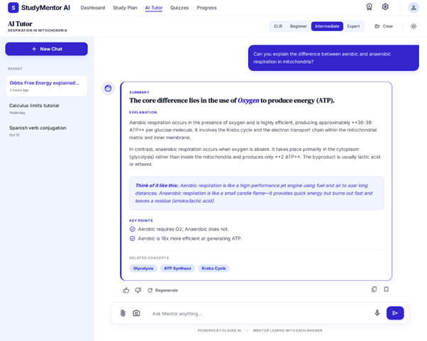
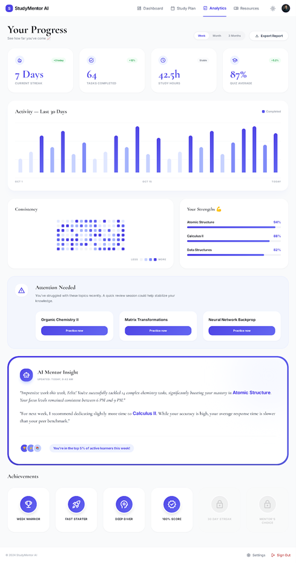

## ✨ Product Showcase

  <strong>Experience the complete AI-powered learning platform.</strong> 
  From personalized study plans to adaptive tutoring and deep analytics,
  every screen is designed to help students learn smarter.

---

### 🏠 Landing Page

  

> A polished marketing homepage showcasing the platform's value proposition,
> social proof, and clear call-to-action to start learning for free.

---

### 📊 Student Dashboard

  

> The command center for students, displaying daily tasks, streaks,
> quiz averages, mentor tips, and personalized upgrade recommendations.

---

### 📚 Personalized Study Plan

  

> Claude AI generates a fully customized multi-week roadmap based on
> learning goals, available study hours, and skill level.

---

### 🧠 AI Tutor

  

> Ask questions naturally, choose explanation depth from ELI5 to Expert,
> and upload photos or PDFs for instant AI-powered concept breakdowns.

---

### 📈 Analytics & Progress Tracking

  

> Visual dashboards track consistency, strengths, study hours,
> achievements, and AI-generated mentor insights.

---

### 🎯 Key Screens at a Glance

| Screen | Purpose |
|------|------|
| 🏠 Landing Page | Convert visitors into users with compelling messaging |
| 📊 Dashboard | Daily productivity and study overview |
| 📚 Study Plan | Personalized weekly learning roadmap |
| 🧠 AI Tutor | On-demand explanations and file-based tutoring |
| 📈 Analytics | Progress, consistency, and performance insights |

---

### 🚀 Built to Feel Like a Real Product

**StudyMentor AI is more than a project. It's a production-ready EdTech SaaS platform
designed to provide every student with a personalized AI mentor.**

